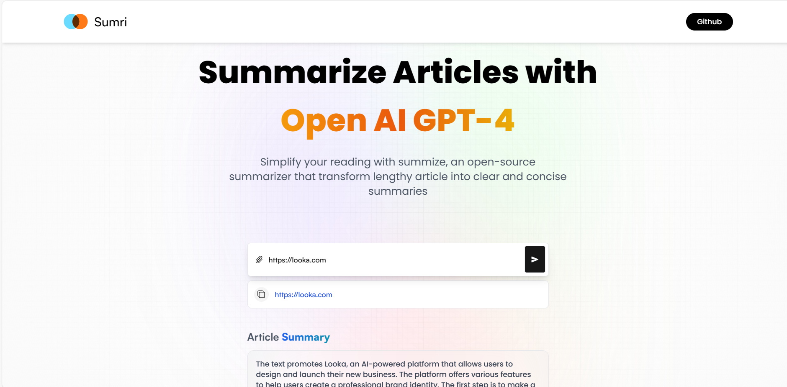

# Sumri

#### _AI article summarizer_

### Powered By

[](https://rapidapi.com/)

[](https://travis-ci.org/joemccann/dillinger)

summize is an open-source summarizer that transform lengthy article into clear and concise summaries

- ✨Magic ✨
- Sumri Live deployment - [sumri ai](https://sumriai.vercel.app/)

## Features

**This project includes the following features:**

- A project to help summarize length articles from your favourite websites.
- A responsive design that works on all devices.
- Local storage to access previous summarization..
- User Authentication with NextAuth and social media login

The Project helped me to gain tons of knowledge on both front end and , i learnt a lot of key concepts in javascript and RTK query for API functionalities.
In addition, I gained adept knowledge on state management with redux toolkit and RKT query for api data fetching and management..

> The Ultimate goal of this project is to create a user-friendly interface
> effective user-friendly functionalities,
> simple navigation, well structured layouts and Search Engine Optimization.

### Screenshots

_Home Page_
;

## Technologies used

**The project used the following technologies**

- [React](https://nextjs.org/) - The React framework for the web
- [Tailwind CSS](https://tailwindcss.com/) - A Frontend library for creating beautiful UI
- [Redux Toolkit](https://redux-toolkit.js.org/) - toolset for efficient app state management

## Installation

Sumri requires [Node.js](https://nodejs.org/) v10+ to run.

Install the dependencies and devDependencies and start the server, the project uses Vite for react set-up, Vite is a next generation frontend tooling for Instant Server Start, and optimization.

**To get started with this project follow the steps:**

- Clone the repository to your local machine

```sh
//Install the dependencies using
npm install
//run the development server using
npm run dev

//Open http://localhost:5733 with your browser to see the result
```

For production environments...

```sh
npm run build --production
```

## Getting Started

First, run the development server:

```bash
npm run dev
# or
yarn dev
# or
pnpm dev
# or
bun dev
```

Open [http://localhost:3000](http://localhost:3000) with your browser to see the result.

This template provides a minimal setup to get React working in Vite with HMR and some ESLint rules.

Currently, two official plugins are available:

@vitejs/plugin-react uses Babel for Fast Refresh
@vitejs/plugin-react-swc uses SWC for Fast Refresh

## Deploy on Vercel

The easiest way to deploy your Next.js app is to use the [Vercel Platform](https://vercel.com/new?utm_medium=default-template&filter=next.js&utm_source=create-next-app&utm_campaign=create-next-app-readme) from the creators of Next.js.

Check out our [Next.js deployment documentation](https://nextjs.org/docs/deployment) for more details.
